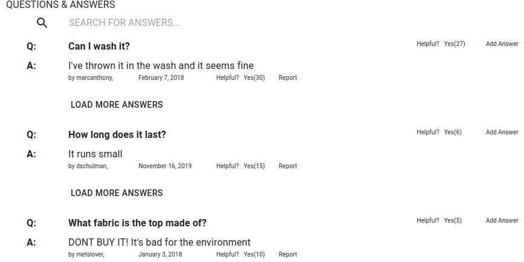
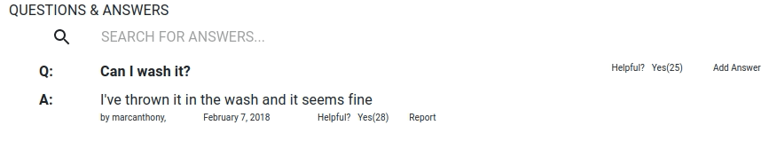

# Clothesy
Client facing retail sales and marketing web portal; replicates Amazon.com product page

## Prerequisites:
If you do not have ***npm or Node.js***, you should install either one (npm is distributed with Node.js)

To check if you have Node.js installed, run this command in your terminal
```node -v```

To install npm
```npm install npm@latest -g```

## Application Installation:
### Webpack build
```npm run build```

### Run server
```npm run server-prod```

### Webpage Outlay
The webpage includes 4 widgets, Product Overview, Related Products, Questions & Answers and Reviews.
I built the Questions and Answers widget (Q&A), hence the below demonstration of only Q&A section functionality.

###


### Search for a Question
Search for a term when the search bar has more than 3 characters
###


### Show More Questions and Answers
Load more questions and more answers for each question.
Initial and subsequent renders are sorted by Helpfulness ranking for each question as well as for each answer
###


### Optimistic Render
Rendering the "Helpfulness" counter and "Report" flag on the front end and then sending the PUT request; on error, return to the original state. Optimistic rendering strategy is chosen for mobile users with low to no connectivity.
Click on the image below for better resolution.
###


## Built With:
* React
* Redux
* Material-UI
* Bootstrap
* Node.js
* Express
* Testing with Jest

## Scrum Members:

* **Eric Luu** [https://github.com/ericlus]
* **Jared Sutton** [https://github.com/jaredasutton/]
* **Kate Harney** [https://github.com/krharney/]

